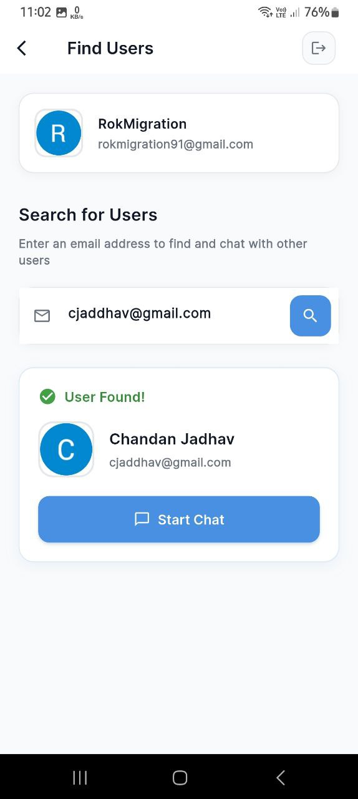
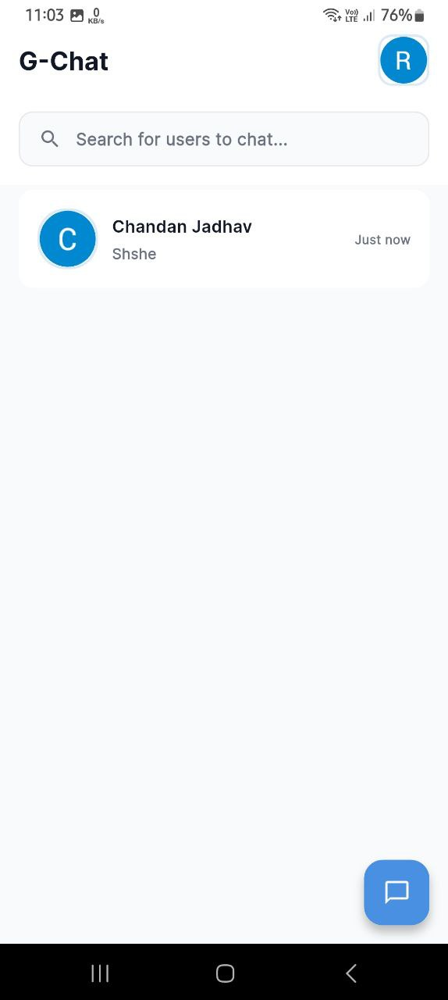
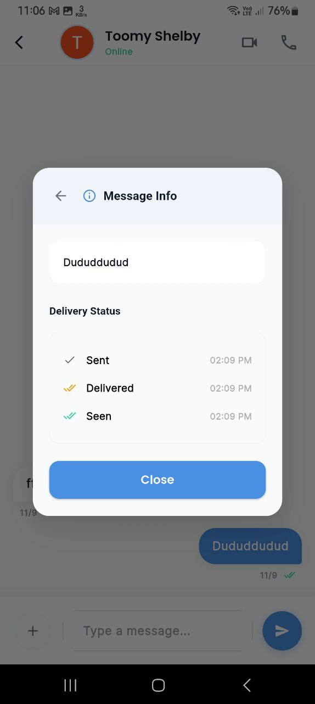
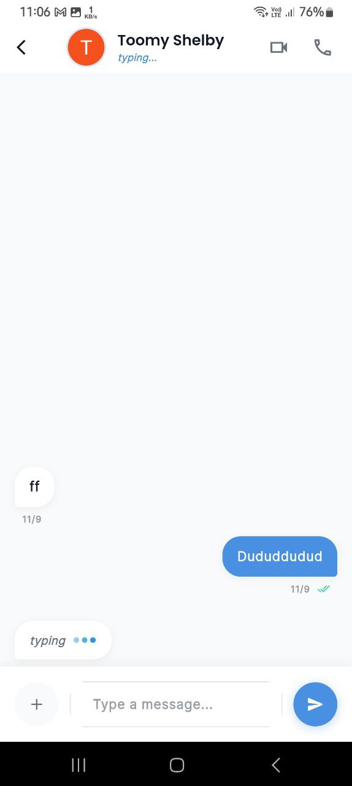

# Flutter Firebase Chat App

A real-time chat application built with **Flutter** and **Firebase** supporting:
- Google Sign-In authentication
- User search by email
- Add users & create chats
- Send/Delete messages (for self and everyone)
- Delivery & read receipts (`sent`, `delivered`, `seen` with timestamp)
- Typing indicators
- Secure Firestore rules

---

## 🔧 Project Setup

### 1. Enable Firebase Services
1. Go to [Firebase Console](https://console.firebase.google.com/).
2. Create a new Firebase project.
3. Enable:
   - **Authentication** → **Sign-in method** → Enable **Google**.
   - **Cloud Firestore**.
   - **Cloud Storage** (optional, if media is used).
4. In **Google Cloud Console**, enable the **Firestore API**.

---

### 2. Add Android App to Firebase
1. Register your app with the package name:
   ```
   com.transbuzz.chatapp
   ```
2. Add your **SHA-1** fingerprint:
   ```bash
   keytool -list -v -alias androiddebugkey -keystore ~/.android/debug.keystore -storepass android -keypass android
   ```
   Copy the `SHA1` and add it in  
   **Firebase Console → Project Settings → Android App → Add fingerprint**.

3. Download the `google-services.json` and place it inside:
   ```
   android/app/
   ```

---

### 3. Generate `firebase_options.dart`
Run the following to generate Firebase config:
```bash
flutter pub add firebase_core
flutter pub add firebase_auth
flutter pub add cloud_firestore
flutter pub add firebase_analytics
flutter pub add google_sign_in
flutterfire configure
```

This will create:
```
lib/firebase_options.dart
```

---

### 4. Android Gradle Setup

#### `android/build.gradle.kts`
```kotlin
buildscript {
    repositories {
        google()
        mavenCentral()
    }
    dependencies {
        classpath("com.google.gms:google-services:4.4.3")
    }
}

allprojects {
    repositories {
        google()
        mavenCentral()
    }
}
```

#### `android/app/build.gradle.kts`
```kotlin
plugins {
    id("com.android.application")
    id("kotlin-android")
    id("dev.flutter.flutter-gradle-plugin")
    id("com.google.gms.google-services")
}

android {
    namespace = "com.transbuzz.chatapp"
    compileSdk = 36

    defaultConfig {
        applicationId = "com.transbuzz.chatapp"
        minSdk = flutter.minSdkVersion
        targetSdk = 36
        multiDexEnabled = true
    }

    buildTypes {
        release {
            isMinifyEnabled = false
            isShrinkResources = false
        }
    }
}

dependencies {
    implementation(platform("com.google.firebase:firebase-bom:32.7.4"))
    implementation("com.google.firebase:firebase-auth")
    implementation("com.google.firebase:firebase-firestore")
    implementation("com.google.firebase:firebase-analytics")
    implementation("com.google.android.gms:play-services-auth:20.7.0")
    implementation("androidx.multidex:multidex:2.0.1")
}
```

#### `android/app/proguard-rules.pro`
```proguard
# Flutter
-keep class io.flutter.** { *; }

# Firebase
-keep class com.google.firebase.** { *; }
-dontwarn com.google.firebase.**

# Google Play Services
-keep class com.google.android.gms.** { *; }
-dontwarn com.google.android.gms.**
```

---

### 5. Firestore Security Rules
```js
rules_version = '2';
service cloud.firestore {
  match /databases/{database}/documents {

    // Users collection
    match /users/{userId} {
      allow read: if request.auth != null;
      allow write, create: if request.auth != null && request.auth.uid == userId;
    }

    // Chats collection
    match /chats/{chatId} {
      allow read, write, create: if request.auth != null &&
        request.auth.uid in request.resource.data.users;
    }

    // Messages
    match /chats/{chatId}/messages/{messageId} {
      allow read: if request.auth != null &&
        request.auth.uid in get(/databases/$(database)/documents/chats/$(chatId)).data.users;

      allow create: if request.auth != null &&
        request.auth.uid == request.resource.data.senderId;

      allow update: if request.auth != null &&
        request.auth.uid in get(/databases/$(database)/documents/chats/$(chatId)).data.users;
    }

    // Typing indicator
    match /chats/{chatId}/typing/{userId} {
      allow read, write: if request.auth != null &&
        (request.auth.uid == userId ||
        request.auth.uid in get(/databases/$(database)/documents/chats/$(chatId)).data.users);
    }
  }
}
```
### 6. Firestore Indexes

Some queries require composite indexes. Set them up in **Firebase Console → Firestore → Indexes**.

#### Required Indexes:

1. **Chats collection**
   - Fields: `users` (array), `lastMessageTime` (descending)

2. **Messages collection (Index 1)**
   - Fields: `status` (ascending), `senderId` (ascending)

3. **Messages collection (Index 2)**
   - Fields: `senderId` (ascending), `createdAt` (descending)

---

## 🚀 Run the App
```bash
flutter clean
flutter pub get
flutter run
```

---

## 📌 Notes
- Do **NOT** commit `google-services.json` or API keys to GitHub.
- Ensure Firestore **indexes** are created (Firebase Console → Firestore → Indexes).
- Firebase Authentication should have **Google Sign-In enabled**.

---

## 📷 Features
- ✅ Google Sign-In authentication  
- ✅ Search users by email  
- ✅ Add to chat list  
- ✅ Send, delete, update messages  
- ✅ Delivery/read receipts with timestamps  
- ✅ Typing indicators  


---

## 📱 App Screenshots

| Add User | Home | Message Info | Typing Indicator |
|----------|------|--------------|------------------|
|  |  |  |  |


